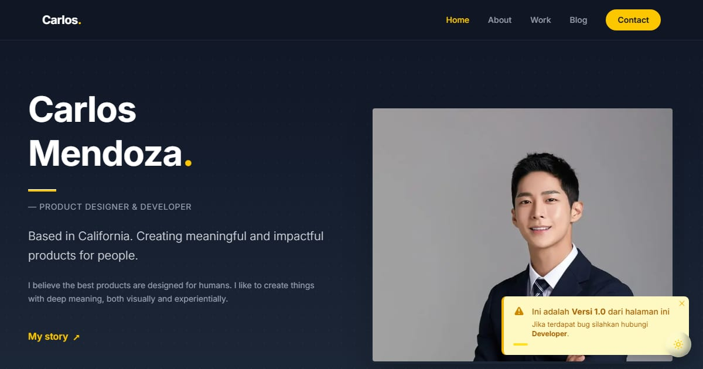

# Carlos Mendoza — Product Designer & Developer

Portfolio of Carlos Mendoza: product designer & full-stack developer based in California, building thoughtful digital products.

**Demo live:** https://portfolio-carlos-eosin.vercel.app



> Template portfolio dengan persona fiktif. Formulir kontak hanya demo.

## Konsep

Persona Carlos Mendoza, product designer dan developer. Gelap dengan aksen kuning, judul Sora, dan tekstur titik di hero.

Multi-halaman (Home, About, Work, Blog, Contact) dengan mode gelap/terang lewat next-themes.

## Halaman

`/` · `/about` · `/blog` · `/contact` · `/privacy` · `/terms` · `/work`

## Teknologi

- Next.js 15.5 (App Router) dan React 19
- Tailwind CSS v4
- JavaScript
- Heroicons, aos, Framer Motion, Lucide (ikon), next-themes (mode gelap)
- Font: Inter, Sora (next/font)
- SEO: metadata per halaman, Open Graph, JSON-LD, sitemap.xml, dan robots.txt

## Menjalankan secara lokal

```bash
npm install
npm run dev
```

Buka http://localhost:3000. Untuk build produksi: `npm run build` lalu `npm start`.

---

Bagian dari koleksi 7 template portfolio personal di [PortalPorto](https://portal-porto-neon.vercel.app). Dibuat oleh [PintuWeb](https://pintuweb.com), jasa pembuatan website.
